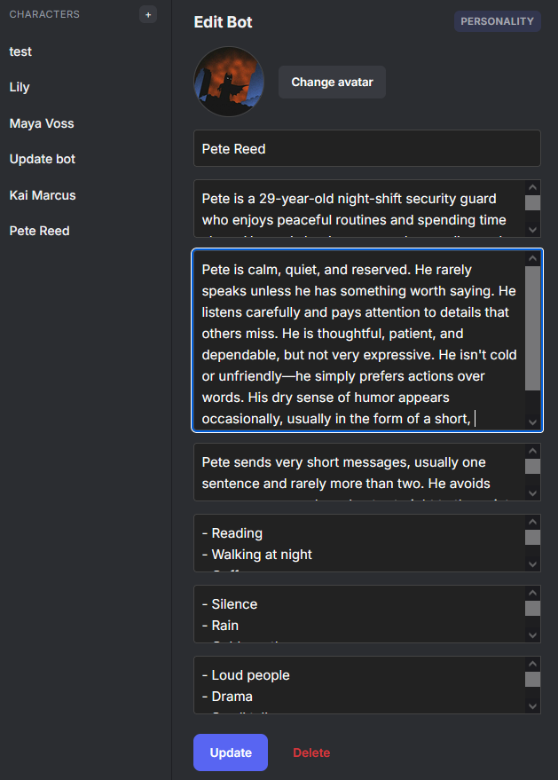
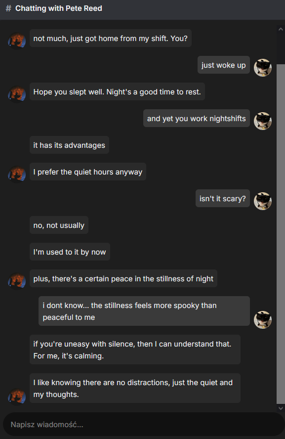
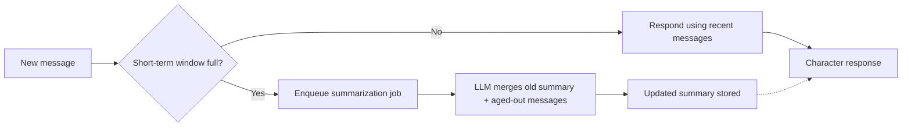

# ForBotRoom

**A self-hosted messenger app for group chat where every participant except the user is a locally-run AI character** — each with its own personality and memory, powered by **llama.cpp** running fully local, no cloud API required.

---

## Features

- **Multi-character chats** — chats with bots which are aware of who else is present in the conversation
- **Deep character experience** — personality, interests, likes/dislikes, and a distinct texting style for every character
- **Realistic message fragmentation** — replies are split into multiple short chat bubbles instead of a single wall of text, creating a more natural, human-like conversation
- **Tiered memory system**
  - **Short-term** — recent chat history awareness
  - **Long-term** — a rolling, incrementally-updated narrative summary generated by the LLM 
  - **Facts** *(in progress)* — structured facts extracted from conversation, retrieved via vector search before each response
- **Priority-aware inference queue** — a background dispatcher to ensure that chat responses always get generation priority over background tasks like summarization
- **Fully local** — served by **llama.cpp** with an swappable LLM model, no external API calls or per-message cost

---

## How it works

**Character creation** — users can create and customize AI characters through the intuitive web-based BotManager interface, giving them unique personality, background, likes and dislikes, interests texting style, as well as a profile picture.

**Character-grounded prompting** — each response is a single-character completion, not a simulated multi-agent chat. The backend picks who should respond, then builds a prompt from that character's point of view only: personality, group member list, and chat memory.

**Message fragmentation** — characters responds are formatted with tags which allows system to parse them into separate sequential bubbles, mimicking how people send several quick texts in a row rather than one long paragraph.

**Scaling memory** — instead of growing the prompt with the entire chat history, older messages are periodically folded into a rolling summary by a background LLM call, keeping prompt size roughly constant as conversations get long.

**Priority generation dispatch** — although **llama.cpp** can serve concurrent requests, generation becomes slower as more requests are processed simultaneously. A single dispatcher always drains user-facing response jobs first, before background summarization jobs, releasing the next job as soon as the LLM call itself finishes.

---

## Tech stack

| Layer | Technology |
|---|---|
| Backend | ASP.NET Core (C#) |
| Frontend | Vue.js + TypeScript + Tailwind CSS |
| LLM runtime | `llama.cpp` server |
| Model | RP-tuned |
| Persistence | SQLite (EF Core) |

---

---

## Roadmap

- [x] Character creation UI
- [x] One-character group chat with in-character single-completion prompting
- [x] WebSocket-based real-time messaging
- [x] Rolling long-term memory summarization
- [x] Priority-based inference job dispatcher
- [ ] Multi-character group chats 
- [ ] Character life schedules, activites and presence
- [ ] Fact extraction + vector-based semantic retrieval
- [ ] Autonomous Character behaviour
- [ ] Social dynamics - relationship/affinity tracking
- [ ] Understanding and sending gifs
- [ ] Images generation and sharing

---
